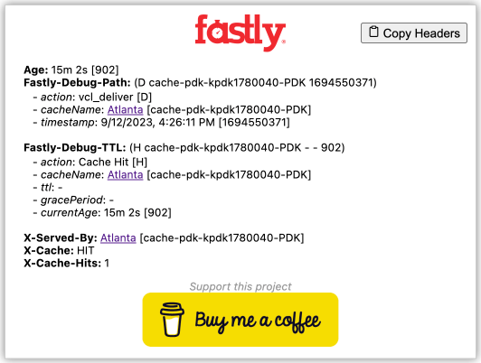

Chrome extension to display debug headers from Fastly

When the icon is clicked, the extension injects the Fastly debug header ("Fastly-Debug:1") and loads the current URL. Once loaded, it extracts the additional cache related headers...

* "Age"
* "Fastly-Debug-Path"
* "Fastly-Debug-TTL"
* "Surrogate-Control"
* "Surrogate-Key"
* "X-Served-By"
* "X-Cache"
* "X-Cache-Hits"

It also parses the cache names to extract human readable Fastly POP locations and timestamps.

*Disclaimer*: This extension is an independent project and is not affiliated with, endorsed by, or sponsored by Fastly, Inc. All trademarks and registered trademarks are the property of their respective owners.
